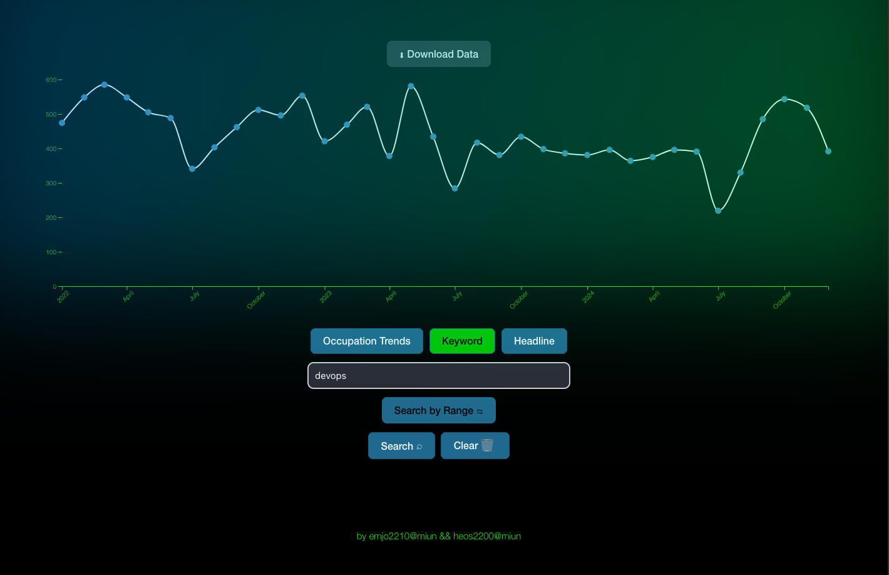

# SELDA - Software Engineering Labor Data Analysis tool

This artifact is divided into three components

1. A Python parsing utility for cleaning the raw `JSONL` files (see https://gitlab.com/arbetsformedlingen/job-ads/getting-started-code-examples/historical-ads-info/-/blob/main/Files.md for data and info).
2. A node express backend for serving frontend and handling DB connection.
3. A compact Vite+React+TS frontend for graphing search data.

Screenshot of frontend:



### 1. Python parsing repo

To use, just place `JSONL` files inside `/resources` and follow instructions after running `python main.py` in repo root. After a file is cleaned, it can be directly imported into PostgreSQL using `PSQL` utility (for more info see `backend/docs/db_setup.md`). This repo also contains plotting scripts used in the thesis.

### 2. Backend Node Express repo

This repo requires a functioning DB, see `backend/docs/db_setup.md`. When this setup just run:

```bash
npm i
npm run dev
```

Optionally, the fronend can be hosted by placing its build output inside `backend/public/`.

### 3. Vite+React frontend

To run frontend

```bash
npm install
npm run dev
```

Optionally, `npm run build` and host it using backend.
