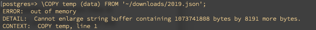
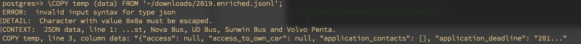
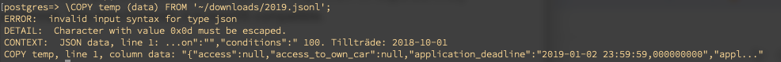
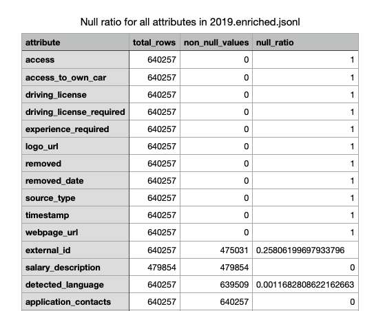

# DB setup log

After setting up the server, we can go ahead and build the table.

```sh
> psql postgres -U newuser
postgres> CREATE TABLE temp (data jsonb);

# Make sure to
```

Now we can start to import the data using psql. Platsbanken supplies some json files in different formats one being .json and the other json lines .jsonl. If one tries to import the .json directly, this happens:



That is because in the .json file, things all exist within an array, and psql tries to read everything at once resulting in buffer overflow. If one instead tries to insert the .jsonl file, this happens:



The 0x0a new lines character must be escaped for psql to read it correctly. If we go back to the 2019.json file and use jq utility (already on my system, probs came along with npm, npx or node).


This command effectively unpacks objects inside arrays and keeps them on separate lines, making it a jsonl format. This time however, it is macOS compatible.

The next step is to try our .jsonl file for import



As visible, we still run into some issues. Most likely this file was exported on a Windows system. Just like Git will complain on windows created text files, and automatically convert them from CRLF to LF format, we can do this using the **dos2unix** utility.

```sh
> brew install dos2unix
> dos2unix ~/downloads/2019.jsonl
```

After doing this the error persists. **sed** utility was also tried, but no success.. Well after trying to many things, there was time to limit the scope of operations to try and drill out the exact cause of the problem.

To do this, we walked back to the source json file, namely '2019.enriched.jsonl' since an already line separate file should make things easier.

```sh
# Limit the testing to only the first 10 lines
cat ~/downloads/2019.enriched.jsonl | head -n 10 > test.jsonl

# Scan this file for return character '\r' and newline character'\n'
grep $'\r' ~/test.jsonl # Returns nothing
grep $'\n' ~/test.jsonl # Returns everything

# To display a json line with pretty format
head -n 1 test_fixed.jsonl | jq
```

The investigation shows that the newline character is the problem, especially its existing inside the json fields. Particularly, this happens inside the free text description of the job ad ("text" attribute).

There are two possible ways to solve this, either you can escape the newline character from "\n" to "\\\n", or just remove it entirely. The second option is probably most inline with this project, since we mostly keep these fields for the eventuality that we need to do a free text search where these characters are not important. To also simplify any free text search, we should probably replace newline characters with a blank space such that words are not accidentally merge (i.e. "end.\nWe are" -> "end.We are").

To automate this in a platform independent step, we can utilize a python script. This will also make any future changes to the data-processing highly modular. For now however, 'jq' will be used to just get the processing done.


`jq -c 'walk(if type == "string" then gsub("\n"; " ") else . end)' ~/downloads/2019.enriched.jsonl  > ~/2019.enriched_fixed.jsonl`

Here, only the step for parsing the complete file is shown, but this can be done with "test.jsonl" too ofc.

To add this to the db we first import each item as 'jsonb' objects (binary json).
```sh
# Start psql
> psql postgres -U newuser

# Create a table for jsonb import. Table name 'temp', column name 'data' and type "jsonb".
postgres> CREATE TABLE temp (data jsonb);

postgres> \COPY temp (data) FROM '~/2019.enriched_fixed.jsonl';
```

This worked for the first 10 lines in testing, but of course the 11th item contained a new special character in 0x09 or '\t'. We will need a more robust approach.

# DB Table Setup

Earlier, we displayed how a temporary table was used to import all individual JSON objects as Postgres 'jsonb' objects. The next step is to migrate these objects to a new table the mostly contains normal DB fields such as INT, TEXT, TIMESTAMP and so on. Doing this will enable the power of a conventional database with indexing, querying and compression to make the data more readily available. 

The first step is to decide on a table schema that is suitable for the data, a task that proved to be far more challenging than expected. After inspecting the first json object in the 2019 dataset, we find that it has a total number of 114 attributes and sub-attributes. Further inspection reveals that 45 attributes are nulled. This set of attributes constitutes a good starting point for pruning unused fields.

### Pruning unused fields

Data collection is hard. Doing it from a live service like *platsbanken* means that the data will change over time. Some data fields are removed, and some are added over time. Our goal is to provide a visualization of the data ranging from 2016-2024, and thus we are interested in common fields that are used throughout this time period. To do this in a repeatable and datadriven manner, we decided to query our data to provide a solid foundation for pruning the data. First we constructed a query that grabs all keys from the json objects of the 2019 set, and measures the ratio of null responses.

```sql
WITH attribute_counts AS (
    SELECT 
        key AS attribute,
        COUNT(*) AS total_rows,
        COUNT(data->>key) AS non_null_values
    FROM temp, jsonb_object_keys(data) AS key
    GROUP BY key
)
SELECT 
    attribute,
    total_rows,
    non_null_values,
    (total_rows - non_null_values)::FLOAT / total_rows AS null_ratio
FROM attribute_counts;
```

The query result is then exported as CSV and sorted ascending on *non_null_values* (_Raw data available in docs/data/null_values_2019.csv_).



The results are interesting. 11 main attributes are *always* null and can be thrown aside. The field 'external_id' is present around 75% of the time, but provides no real information that fits our purposes. It is not documented, and we suspect it is a field that the employer can use for reference. Furthermore, 'salary_description' only exist as a key in a subset of values, making it unsuitable for our table, especially since the field 'salary_type' is always present. In total, we therefore prune 13 attributes in this round.

### Investigating nested attributes

15 of the 44 main attributes store nested json objects (sub-attributes) or arrays. These can be investigated using the following query.

```sql
WITH nested_attribute_counts AS (
    SELECT 
        'application_details.' || key AS attribute,
        COUNT(*) AS total_rows,
        COUNT(data->'application_details'->>key) AS non_null_values
    FROM temp, jsonb_object_keys(data->'application_details') AS key
    GROUP BY key
)
SELECT 
    attribute,
    total_rows,
    non_null_values,
    (total_rows - non_null_values)::FLOAT / total_rows AS null_ratio
FROM nested_attribute_counts;
```

After investigating all array objects, and all nested fields, we could remove many fields. Furthermore, it was shown that many objects such as 'occupation_field' will always fill all three sub-attributes at the same rate, meaning that we can unnest one of them without losing data. As a final touch, we made a choice that keywords.enriched.skills seemed like the most relevant field in that field, and decided to unnest that value. The final result can be the basis for the following sql table.
